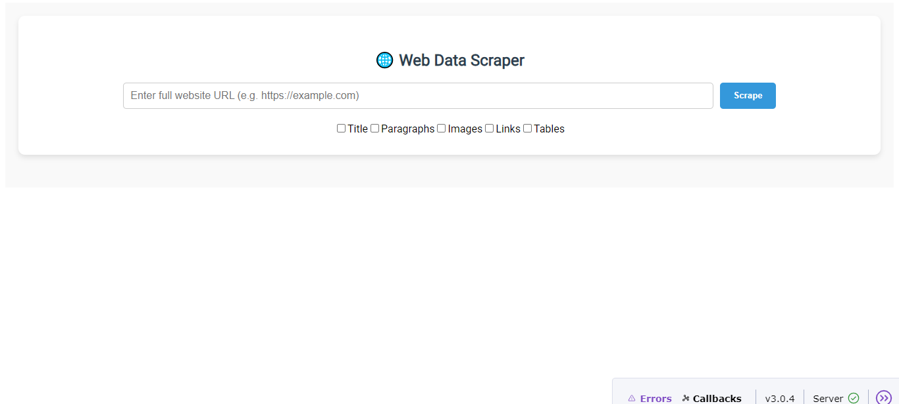

# 🌐 Web Data Scraper

A simple and powerful web app to **scrape website content** and export it to **Excel** – built with Python, Dash, and BeautifulSoup.



## 🚀 Features

- 🔎 Extracts:
  - ✅ Page Title  
  - ✅ Paragraphs  
  - ✅ Images (with thumbnails)  
  - ✅ Hyperlinks  
  - ✅ HTML Tables (into Excel sheets)

- 📄 Exports all selected data to a clean `.xlsx` file  
- 📊 Live preview of content inside the app  
- 🖱️ User-friendly interface with checkboxes  
- ⚙️ No backend setup – runs locally as a Dash app

## 🛠️ Built With

- Python  
- Dash (by Plotly)  
- BeautifulSoup  
- OpenPyXL  
- Requests

## 📦 How to Run

```bash
git clone https://github.com/HeebaShaikh0705/Website-Data-Scraper.git
cd Website-Data-Scraper
pip install -r requirements.txt
python app.py
